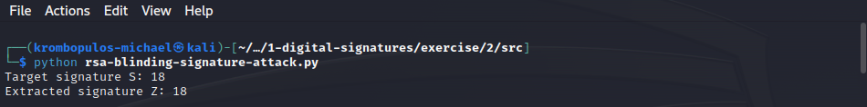

# RSA Blinding Signature Attack

This exercise's goal is to understand the concept, and
demonstrate an example of an RSA Blinding Signature Attack.

## Table of Contents

- [Explanation](#explanation)
	- [Key Generation](#key-generation)
	- [Message Signing](#message-signing)
- [Exercice:](#exercice)
	- [Instructions](#instructions)
	- [Solution](#solution)
		- [Setup](#setup)
		- [The RSA Blinding Signature Attack](#the-rsa-blinding-signature-attack)
- [References](#references)

## Explanation

Consider a signing entity that employs a server for creating
[RSA](<https://en.wikipedia.org/wiki/RSA_(cryptosystem)>)
signatures for messages from users (maybe as an API).

We assume that the server follows a standard RSA signature process,
which involves key generation and signing messages.

However,
there may be restrictions on the messages that can be signed,
and certain messages might be prohibited.

The RSA Blinding Signature Attack allows obtaining a valid signature $S$
for a target message $M$

by constructing an alternative message $W$
that when signed by the server,
produces a signature $Z$
from which the target signature $S$ can be derived.

We know that the server will certainly perform the RSA
[key generation](#key-generation) as a setup step,
and [message signing](#message-signing):

### Key Generation

1. Choose two large prime numbers, $p$ and $q$.
2. Compute the modulus, $n = p \cdot q$.
3. Calculate
   [Euler's totient function](https://en.wikipedia.org/wiki/Euler%27s_totient_function)
   for $n$: $φ(n) = (p-1) \cdot (q-1)$.
4. Choose an integer $e$ such that and $gcd{(e, φ(n))} = 1$.
5. Determine the private exponent $d$ such that $d ≡ e^{-1} \pmod{φ(n)}$.

The _public key_ consists of the modulus $n$ and the public exponent $e$.

The private key consists of the _private exponent_ $d$,
which must be kept secret along with $p$, $q$, and $φ(n)$.

### Message Signing

When the server signs a message $M$,
it raises $M$ to the power of $d$ (modulo $n$)
to produce the signature $S$:

$$S ≡ M^d \pmod{n}$$

### RSA Blinding Signature Attack

If the server restricts the signing of a specific message $M$,
to obtain a valid signature $S$ for the target message $M$,
we need to construct an alternative message $W$, such that
when it is signed by the server,
the produced signature will be a bijective expression $Z = f(S)$ of the target signature $S$,
that should be easy to invert; that is

$$Z \equiv W^d \pmod{n}$$
$$\Leftrightarrow Z^e \equiv W^{e \cdot d} \pmod {n}$$

starting with this expression, we can leverage the properties of
[Euler's theorem](https://en.wikipedia.org/wiki/Euler%27s_theorem)
and the key generation process to determine the alternative message $W$:

By [step 5 of key generation](#key-generation), we have
$e \cdot d ≡ 1 \pmod{φ(n)}$,

which implies that for some integer $k$:

$$e \cdot d = k \cdot φ(n) + 1$$

Substituting this into the equation, we get:

$$Z^e \equiv W^{e \cdot d} \pmod {n}$$
$$\Leftrightarrow Z^e \equiv W^{k \cdot φ(n) + 1} \equiv [W^{φ(n)}]^k \cdot W \pmod {n}$$

Using Euler's theorem, if $\gcd{(W, n)} = 1$,
then $W^{φ(n)} \equiv 1 \pmod{n}$.
Therefore:

$$W \equiv Z^e \pmod{n}$$

By considering a simple (and easily inversable) expression
$Z = f(S) = c \cdot M^d$,
where $c$ is a constant,
we can derive a suitable message $W$ like so:

$$W \equiv (c \cdot M^d)^e \pmod{n} \Leftrightarrow W \equiv c^e \cdot M^{e \cdot d} \pmod{n}$$
$$\Leftrightarrow W \equiv c^e \cdot M^{k \cdot φ(n) + 1} \pmod{n}$$

Again, using Euler's theorem, if $\gcd{(M, n)} = 1$,
then $M^{φ(n)} \equiv 1 \pmod{n}$.
Thus:

$$W \equiv c^e \cdot M \pmod{n}$$

For the above to hold,
$M$ should be coprime to $n$, i.e.,
$p$ and $q$ do not divide $M$.

So, if $\gcd{(c,n)} = 1$, then the signature $Z$ for the message $W$ will be:

$$Z \equiv W^d \equiv (c^e \cdot M)^d \equiv c^{e \cdot d} \cdot M^d \equiv c^{k \cdot φ(n) + 1} \cdot S \equiv (c^{φ(n)})^k \cdot c \cdot S \equiv c \cdot S \pmod{n}$$

Hence, we can recover the target signature by multiplying with $c^{-1}$:

$$S \equiv c^{-1} \cdot Z \pmod{n}$$

The conditions we need to keep in mind are:

-   $\gcd{(M,n)} = 1$
-   $\gcd{(c,n)} = 1$
-   $\gcd{(W = c^e \cdot M,n)} = 1$

If we can assume that $p, q > 2$,
then $\gcd{(c = 2, n = p \cdot q)} = 1$.

Then it follows that $\gcd{(W =2^e \cdot M, n = p \cdot q)} = 1$,
thus selecting by $c = 2$ we get $W = 2^e \cdot M$,
and we extract the target signature using the relation $S \equiv 2^{-1} \cdot Z \pmod{n}$.

## Exercice:

### Instructions

"You are given the RSA _public key_ $\{N = 77, e = 11\}$.
Let a signing entity that doesn’t sign the message “flag”.
Can you bypass this constraint and get a valid signature for the message?"

### Solution

We will implement the method described in the [previous section](#explanation)
in `src/rsa-blinding-signature-attack.py` which is is a python script that demonstrates
an RSA Blinding Signature Attack.

#### Setup

The message "flag" is a string, but messages in RSA should be represented as integers.
For this reason, we're going to use the `string2int` function from `DigitalSignatures`.
Let's import the `string2int` function:

```python
from DigitalSignatures.string2int import string2int
```

We want to check if our results are correct.
So, we're going to compare the target signature for the target message
with the signature we're going to extract from the signature of the alternative message.
So, we need to sign the messages,
which means we will need the entity's private key.

Luckily, the numbers involved are very small, hence we can easily derive the private key.
We're given that $\{N = 77, e = 11\}$
so, obviously the prime numbers $p$, and $q$ are $7$, and $11$,
respectively.

The signing entity's server will perform the RSA Key Generation process:

```python
# RSA Key Generation (server-side)

p, q = 7, 11  # The two prime numbers, as given in the instructions
N = p * q  # Calculate the product of the two primes `N`

# Calculate the value of Euler's totient function at `N`
t = (p - 1) * (q - 1)

e = 7  # Set public exponent, as given in the instructions

# Calculate the private exponent `d` (private key),
# as the multiplicative inverse of the public exponent mod `t`
d = pow(e, -1, t)
```

The server will provide some API for message signing:

```python
# Server message signing (as API)
def sign(M):
        return pow(M, d, N)
```

Let's now use the `string2int` function on the message "flag",
to get its integer representation `M`:

```python
# Get the integer representation
# of the message "flag"
M = string2int("flag")
```

For the aforementioned reasons (validating our results),
we're going to calculate and print the target signature `S`:

```python
# To validate results in the demo
# calculate the signature for `M`
# if it was allowed by the server
S = sign(M)
print("Target signature S:", S)
```

Now, we're going to perform the RSA Blinding Signature Attack.
From the previous variables we are only allowed to use:

-   the message `M`,
-   public key (`e`, `N`), and
-   the message signing API as the function `sign()`.

#### The RSA Blinding Signature Attack

So, as explained in [the previous section](#explanation)
we're going to construct the alternative message $W = 2^e \cdot M$,
obtain the signature for the alternative message $Z$, and finally,
extract the target signature $S \equiv 2^{-1} \cdot Z \pmod{N}$:

```python
# The RSA Blinding Signature Attack:

# Calculate the alternative message `W`
W = 2**e * M

# Get the signature for `W`
Z = sign(W)

# Extract target signature from `Z`
print( "Extracted signature Z:", pow(2, -1, N) * Z % N )
```

Running the script `rsa-blinding-signature-attack.py` in the command line,
we get the following results:



So, we successfully obtained a valid signature for the message "flag".

## References

-   [RSA (cryptosystem)](<https://en.wikipedia.org/wiki/RSA_(cryptosystem)>)

-   [Euler's totient function](https://en.wikipedia.org/wiki/Euler%27s_totient_function)

-   [Euler's theorem](https://en.wikipedia.org/wiki/Euler%27s_theorem)

-   University of Piraeus 🦆 - Mobile and Wireless Communications Security 🔐

<script type="text/javascript" src="http://cdn.mathjax.org/mathjax/latest/MathJax.js?config=TeX-AMS-MML_HTMLorMML"></script>
<script type="text/x-mathjax-config">
  MathJax.Hub.Config({ tex2jax: {inlineMath: [['$', '$']]}, messageStyle: "none" });
</script>
